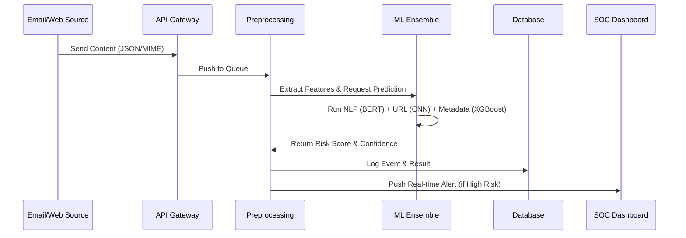
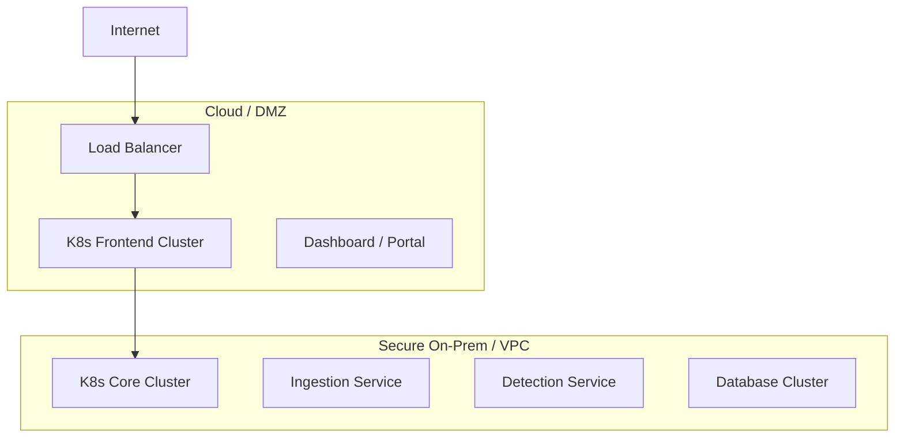

# Phase 2: High-Level Architecture

## 1. High-Level System Architecture

The system is built on a microservices event-driven architecture to ensure scalability and fault tolerance.

```mermaid
graph TD
    User[User / Client] -->|Email/SMS/Web| IngestionLayer
    User -->|Report Phishing| API_Gateway

    subgraph "Ingestion Layer"
        IngestionLayer[Normalization & Queuing]
        Kafka[Apache Kafka / RabbitMQ]
    end

    IngestionLayer --> Kafka

    subgraph "Core Detection Engine"
        FeatureExtract[Feature Extraction Service]
        ModelServing[Model Serving Layer (TF Serving/TorchServe)]
        Ensemble[Ensemble Decision Engine]
    end

    Kafka --> FeatureExtract
    FeatureExtract --> ModelServing
    ModelServing --> Ensemble

    subgraph "Data & Knowledge"
        Redis[Redis Cache (Hot Data)]
        Postgres[PostgreSQL (Metadata & Logs)]
        Elastic[Elasticsearch (Threat Hunting)]
        ThreatIntel[Threat Intelligence Feeds]
    end

    Ensemble --> Redis
    Ensemble --> Postgres
    Ensemble --> Elastic
    ThreatIntel --> FeatureExtract

    subgraph "Response & Mitigation"
        Response[Response Orchestrator]
        SOAR[SOAR Integration]
        Alerting[Notification Service]
    end

    Ensemble --> Response
    Response --> SOAR
    Response --> Alerting
```

## 2. AI/ML Model Pipeline Diagram

The ML pipeline handles continuous training and real-time inference.

```mermaid
flowchart LR
    subgraph "Training Pipeline"
        RawData[Raw Datasets (Enron, PhishTank)] --> Preprocessing
        Preprocessing --> FeatureEng[Feature Engineering]
        FeatureEng --> Training[Model Training (AutoML)]
        Training --> Validation[Cross-Validation]
        Validation --> ModelReg[Model Registry (MLflow)]
    end

    subgraph "Inference Pipeline"
        LiveTraffic --> FeatureExtract_Inf[Real-time Featurization]
        FeatureExtract_Inf --> ModelLoader
        ModelReg -->|Pull Best Model| ModelLoader
        ModelLoader --> Inference --> Result
    end
```

## 3. Data Flow Diagram (DFD)

Data movement from ingress to actionable intelligence.



## 4. Threat Detection Workflow

Logic flow for determining if an item is malicious.

```mermaid
graph TD
    Start[New Item Received] --> WhitelistCheck{On Whitelist?}
    WhitelistCheck -- Yes --> Safe[Mark Safe]
    WhitelistCheck -- No --> StaticAnalysis[Static Analysis (Headers/Regex)]
    
    StaticAnalysis --> IOC_Check{Known IOC?}
    IOC_Check -- Yes --> Block[Block Immediately]
    IOC_Check -- No --> ML_Analysis[AI/ML Deep Scan]

    ML_Analysis --> NLP[NLP Content Analysis]
    ML_Analysis --> URL[URL Vision/Lexical]
    ML_Analysis --> Social[Social Graph]

    NLP & URL & Social --> Ensemble[Vote / Risk Score]
    Ensemble --> Threshold{Score > Threshold?}
    
    Threshold -- Yes --> Block
    Threshold -- No --> Safe
```

## 5. Deployment Architecture (Cloud + On-Prem)

Hybrid deployment model supporting secure enterprise environments.



## 6. Zero Trust Security Model

Implementation of Zero Trust principles within the component interaction.

- **Identity First:** All service-to-service communication requires mTLS.
- **Least Privilege:** Containers run as non-root; Read-only filesystems where possible.
- **Continuous Validation:** API tokens rotated every 1 hour.
